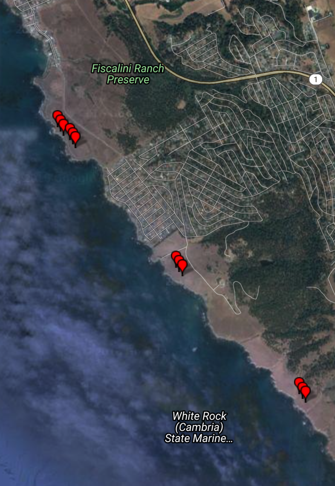
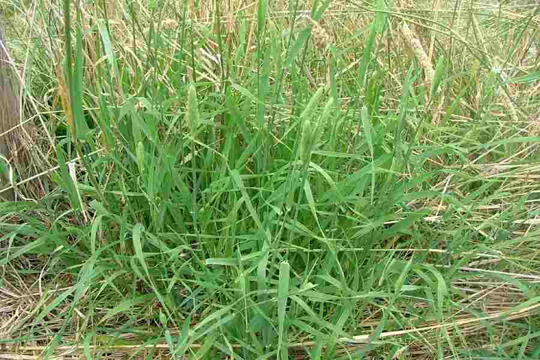

---
title:
author: "cjlortie"
date: "August 2016"
output:
  html_document:
    theme: yeti
    toc: yes
    toc_depth: 3
    toc_float: yes
  pdf_document:
    toc: yes
---
##A set of code for research program on invasion.

###Hypothesis
Management history and invasive plant species restructure community structure and composition in coastal, terrace grasslands.


[cjlortie](http://christopherlortie.info)

###Methods
Two distinct sites - one UC Reserve and one preserve.
Two transects per site for a total of 3 days sampling for invertebrates and vertebrates.
Plant community structure and composition was assessed in one census.
Each transect was 100m in length.  A set of 25 points were selected randomly.
A total 8 animal cams were deployed per transect per day/night.
A total of 6 pollinator cams were deployed per transect per day.
A total of 25 0.5 x 0.5m quadrats were censues for plants.



Phalaris aquatica (Harding Grass) is common in the UC Reserve. Harding Grass was planted at the first site sampled within the UC Reserve, and the soil was also tilled at this site (transect 1). At the second UC site, there was almost no Harding Grass, and it was not planted at this site within the reserve (transect 2). There was no Harding Grass at either of the sites sampled with the Fiscalini Ranch Preserve.




```{r, setup, include=FALSE}
knitr::opts_chunk$set(cache=TRUE)
#library loads ####
#library(dplyr)
#library(lme4)
#library(lattice)
#library(latticeExtra)
#library(ggplot2)

```

### EDA Vertebrates
```{r, vertebrates}
#if you copy and paste into r-studio or r, getwd and setwd first
#ensure your data file is in that wd or folder
#getwd()
#setwd()
#install.packages('ggplot2')

#load data
data <-read.csv("data/vertebrates.csv")
str(data) #check dataframe
data$rep.day <-as.factor(data$rep.day) #r did not know day was a factor
data$transect <-as.factor(data$transect) #r did not know transect was a factor

#Visualize data
library(ggplot2)
#ggplot2
#Cambria-level visualizations
qplot(abundance, data=data)
qplot(diversity, data=data)
qplot(management, abundance, geom="boxplot", data=data)
qplot(management, diversity, geom="boxplot", data=data)
qplot(management, bare.cover, geom="boxplot", data=data)
qplot(management, harding.cover, geom="boxplot", data=data)

#Site & day level visualizations
qplot(rep.day, abundance, data=data, geom="boxplot", facets = site~.)
qplot(rep.day, diversity, data=data, geom="boxplot", facets = site~.)
qplot(rep.day, rate.hr, data=data, geom="boxplot", facets = site~.)
qplot(rep.day, harding.cover, data=data, geom="boxplot", facets = site~.)

#effect of Harding Grass
qplot(harding.cover, abundance, data=data, geom="smooth", method="lm")
qplot(harding.cover, diversity, data=data, geom="smooth", method="lm")
qplot(harding.cover, rate.hr, data=data, geom="smooth", method="lm")

#basic stats for main effects
#EDA
m1<-glm(abundance~harding.cover, family=gaussian, data=data)
m1
anova(m1, test="Chisq")

m2<-glm(diversity~harding.cover, family=poisson, data=data)
m2
anova(m2, test="Chisq")


m3<-glm(rate.hr~harding.cover, family=gaussian, data=data)
m3
anova(m3, test="Chisq")


#More advanced tests for vertebrate patterns
#test covariates
m4<-glm(abundance~harding.cover*animal.sign*bare.cover, family="gaussian", data=data)
m4
anova(m4, test="Chisq")
qplot(animal.sign, abundance, data=data)

```

###EDA invertebrates
```{r, invertebrates}
#if you copy and paste into r-studio or r, getwd and setwd first
#ensure your data file is in that wd or folder
#getwd()
#setwd()
#install.packages('ggplot2')

#load data
data <-read.csv("data/invertebrates.csv")
str(data) #check dataframe
data$rep.day <-as.factor(data$rep.day) #r did not know day was a factor
data$transect <-as.factor(data$transect) #r did not know transect was a factor

#Visualize data
library(ggplot2)
#ggplot2
#Cambria-level visualization
qplot(abundance, data=data)
qplot(diversity, data=data)
qplot(management, abundance, geom="boxplot", data=data)
qplot(management, diversity, geom="boxplot", data=data)
qplot(management, bare.cover, geom="boxplot", data=data)
qplot(management, harding.cover, geom="boxplot", data=data)

#Site & day level visualization
qplot(rep.day, abundance, data=data, geom="boxplot", facets = site~.)
qplot(rep.day, diversity, data=data, geom="boxplot", facets = site~.)
qplot(rep.day, rate.hr, data=data, geom="boxplot", facets = site~.)
qplot(rep.day, harding.cover, data=data, geom="boxplot", facets = site~.)

#effect of Harding Grass
qplot(harding.cover, abundance, data=data, geom="smooth", method="lm")
qplot(harding.cover, diversity, data=data, geom="smooth", method="lm")
qplot(harding.cover, rate.hr, data=data, geom="smooth", method="lm")

#basic stats for main effects
#EDA
m1<-glm(abundance~harding.cover, family=gaussian, data=data)
m1
anova(m1, test="Chisq")

m2<-glm(diversity~harding.cover, family=poisson, data=data)
m2
anova(m2, test="Chisq")


m3<-glm(rate.hr~harding.cover, family=gaussian, data=data)
m3
anova(m3, test="Chisq")


#More advanced tests for invertebrate patterns
#test covariates or importance of sampling method
#sampling method
m4<-glm(abundance~harding.cover*method, family="gaussian", data=data)
m4
anova(m4, test="Chisq")
#install.package("lsmeans")
library(lsmeans)
lsmeans(m4, pairwise~method, adjust="tukey")
qplot(method, abundance, geom="boxplot", data=data)

```

###EDA Plants
```{r, plants}
#if you copy and paste into r-studio or r, getwd and setwd first
#ensure your data file is in that wd or folder
#getwd()
#setwd()
#install.packages('ggplot2')

#load data
data <-read.csv("data/plants.fine.csv")
str(data) #check dataframe
data$rep.day <-as.factor(data$rep.day) #r did not know day was a factor
data$transect <-as.factor(data$transect) #r did not know transect was a factor

#Visualize data
library(ggplot2)
#ggplot2
#Cambria-level visualizations
qplot(abundance, data=data)
qplot(diversity, data=data)
qplot(management, abundance, geom="boxplot", data=data)
qplot(management, diversity, geom="boxplot", data=data)
qplot(management, bare.cover, geom="boxplot", data=data)
qplot(management, harding.cover, geom="boxplot", data=data)

#Site & transect level visualizations
qplot(site, abundance, data=data, geom="boxplot", facets=transect~.)
qplot(site, diversity, data=data, geom="boxplot", facets=transect~.)
qplot(site, native.flowers, data=data, geom="boxplot", facets=transect~.)
qplot(site, harding.cover, data=data, geom="boxplot", facets=transect~.)

#effect of Harding Grass
qplot(harding.cover, abundance, data=data, geom="smooth", method="lm")
qplot(harding.cover, diversity, data=data, geom="smooth", method="lm")
qplot(harding.cover, native.flowers, data=data, geom="smooth", method="lm")
qplot(harding.cover, native.density, data=data, geom="smooth", method="lm")

#basic stats for main effects
#EDA
m1<-glm(abundance~harding.cover, family=gaussian, data=data)
m1
anova(m1, test="Chisq")

m2<-glm(diversity~harding.cover, family=poisson, data=data)
m2
anova(m2, test="Chisq")


m3<-glm(native.flowers~harding.cover, family=gaussian, data=data)
m3
anova(m3, test="Chisq")

m4<-glm(native.density~harding.cover, family=gaussian, data=data)
m4
anova(m4, test="Chisq")

#More advanced tests for plant patterns
#test covariates or invasional meltdown
#meltdown test for negative interactions
qplot(harding.cover, exotic.plant.cover, data=data, geom="smooth", method="lm")
m5<-glm(exotic.plant.cover~harding.cover, family="gaussian", data=data)
m5
anova(m5, test="Chisq")

#meltdown test for differences between sites with and without harding
qplot(management, exotic.plant.cover, data=data, geom="boxplot")
m6<-glm(exotic.plant.cover~management, family="gaussian", data=data)
m6
anova(m6, test="Chisq")

```

###Contrasts within Rancho Marino
```{r, within Rancho Marino}
#install.packages("dplyr")
library(dplyr)
#select proper 'data' object to iterate from
RM<- data %>% filter(site == "RM")
#str(RM)
t1 <-t.test(abundance~site, data=data)
t1
t1$p.value

t2 <-t.test(diversity~site, data=data)
t2
t2$p.value

```

